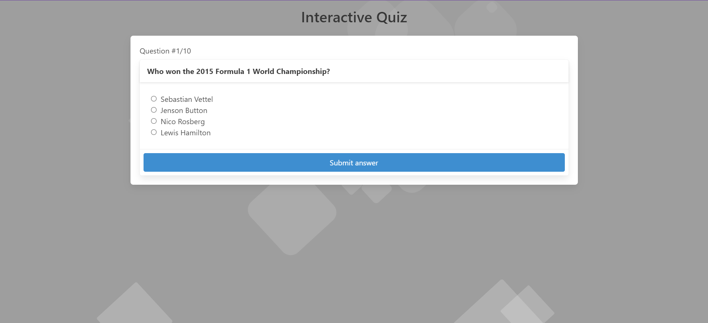
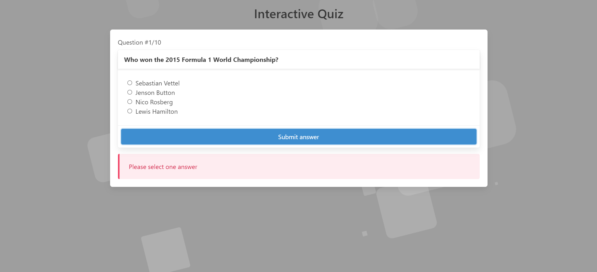
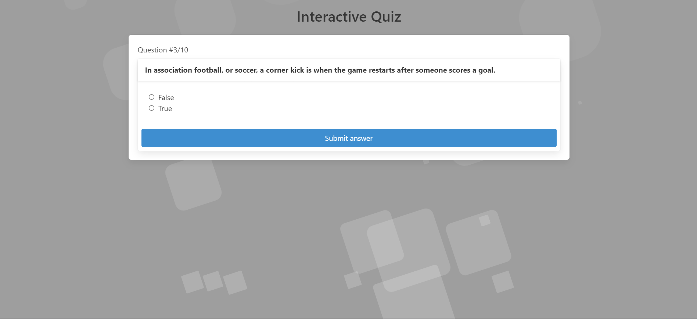
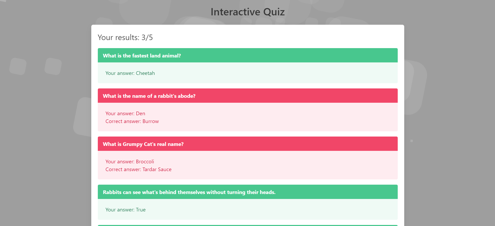

<h1 align="center"> Quiz Interativo </h1>

Projeto desenvolvido no treinamento programador fullstack (Realizado pelo SENAI), do programa Meu Primeiro Emprego.  
<a href="https://primeiroemprego.se.gov.br/" target="_blank">Mais informações sobre o programa Meu Primeiro Emprego.</a>

 
  

Tela Inicial de criação do Quiz.

 
  

Quiz com perguntas.

 
  

Filtro para não deixar uma resposta vazia.

 
  

Quiz com questões True/False.

 
  

Tela para mostrar os resultados.

  <a href="https://diegoribeiro.netlify.app/" style="font-weight: bold;" target="_blank">💎 Link para o projeto.</a>

## 🚀 Tecnologias

Esse projeto foi desenvolvido com as seguintes tecnologias:

- Typescript
- React
- Bulma
- Vite

## 💻 Projeto

O projeto tem como objetivo a criação de um quiz interativo utilizando Typescript e React. Para agregar dinamismo ao quiz, foi realizado o consumo da API "Trivia API". No entanto, é importante destacar que essa API retorna perguntas e respostas apenas em inglês. Em resposta a essa limitação, ajustei a estrutura do site para adequá-la à língua da API.

Um elemento fundamental no desenvolvimento foi a utilização do Bulma, um framework CSS que simplificou e estabeleceu um padrão para o estilo do projeto. A integração do Bulma proporcionou uma estética coesa e atrativa ao quiz, contribuindo significativamente para a experiência do usuário.

No âmbito do desenvolvimento, Typescript e React desempenharam papéis cruciais. A estruturação das páginas, a tipagem de arquivos, a criação de componentes e o tratamento das informações provenientes da API foram facilitados pela combinação dessas tecnologias. A adoção de Typescript permitiu uma abordagem mais segura e robusta no desenvolvimento, tornando mais fácil a identificação e correção de erros durante o processo.

Ao unir essas tecnologias e ferramentas, foi possível criar um quiz interativo, estilizado de forma atraente e com uma base sólida de desenvolvimento. O projeto destaca a sinergia entre Typescript, React, Bulma e a API utilizada, resultando em uma aplicação dinâmica, responsiva e envolvente para os usuários.

## 🔖 Layout

O Layout do projeto foi baseado em um tutorial do Youtube. Sendo que, modificações foram feitas pelo desenvolvedor afim de torna-lo mais pessoal, do seu gosto e condizente com a as demandas passadas em sala pelo professor.
<ul>
<li>link de referência:</li>
<a href="https://www.youtube.com/watch?v=vj2kUw7372Y&list=PLjGomq7bcPFEgKqYGj6utbttp5u6PMEj1&index=29">React Typescript Quiz with Open Trivia Database API</a>
</ul>
